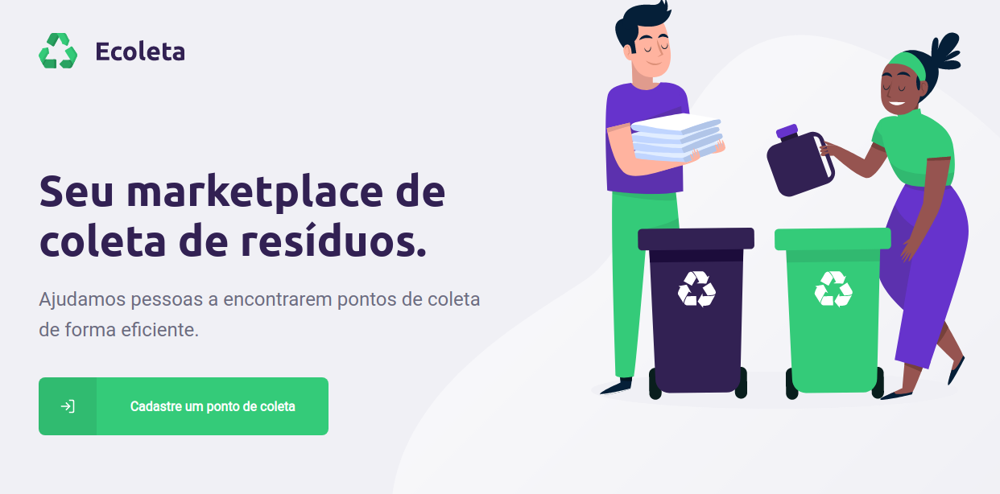

<h1>
  
</h1>

<p align="center">
<a href="#sobre">Sobre</a>&nbsp;&nbsp;&nbsp;|&nbsp;&nbsp;&nbsp;
  <a href="#tecnologias">Tecnologias</a>&nbsp;&nbsp;&nbsp;|&nbsp;&nbsp;&nbsp;  
  <a href="#como-baixar-o-projeto">Como utilizar o projeto</a>
</p>

## Sobre
O projeto Ecoleta foi desenvolvido durante o evento Next Level Week da Rocketseat, este projeto ajuda os coletores de resíduos a cadastrar seus pontos de coleta utilizando a plataforma web e os possíveis interessados a localizar estes pontos utilizando o app mobile.

---

##  Tecnologias
O projeto Ecoleta foi desenvolvido durante o evento Next Level Week da Rocketseat usando as seguintes tecnologias:

-  [ReactJS](https://reactjs.org/)
-  [Node.js](nodejs)
-  [React Native](https://reactnative.dev/)
-  [TypeScript](https://www.typescriptlang.org/)
-  [Leaflet](https://leafletjs.com/examples/quick-start/)

---

## API Externa
O projeto web e mobile utilizaram a API do IBGE para carregadas os estados e os municípios.

-  [IBGE](https://servicodados.ibge.gov.br/api/docs/localidades)

---

## Como baixar o projeto

```bash

  # Clonar o repositório
  $ git clone https://github.com/DaywisonFerreira/ecoleta.git

  # Entrar no diretório server, instalar as dependências e rodar o servidor (NodeJS)
  $ cd server
  $ npm install
  $ npm run dev

  # Entrar no diretório web, instalar as dependências e iniciar o projeto (ReactJS)
  $ cd web
  $ npm install
  $ npm start

  # Entrar no diretório mobile, instalar as dependências e iniciar o projeto (React Native)
  $ cd mobile
  $ npm install
  $ npm start

  # Para utilizar o aplicativo mobile será necessário utilizar o app Expo (Disponível nas plataformas de aplicativos) após a instalação será necessário escanear o QRCode que será exibido quando iniciar o projeto mobile

  ```
  ----
### Desenvolvido com :heart: por Daywison Leal 
[LinkedIn] (https://www.linkedin.com/in/daywison-leal/)


